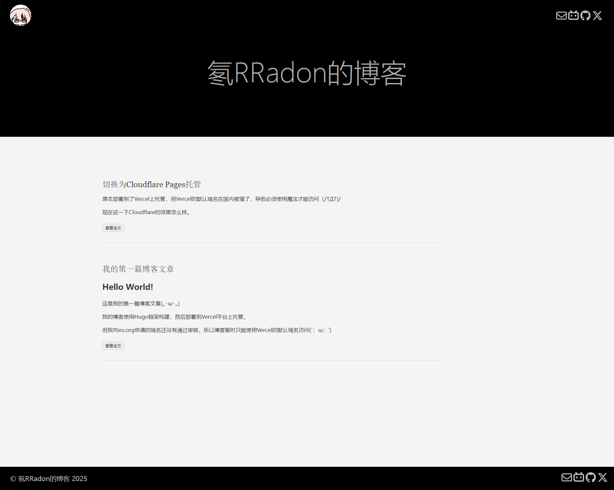
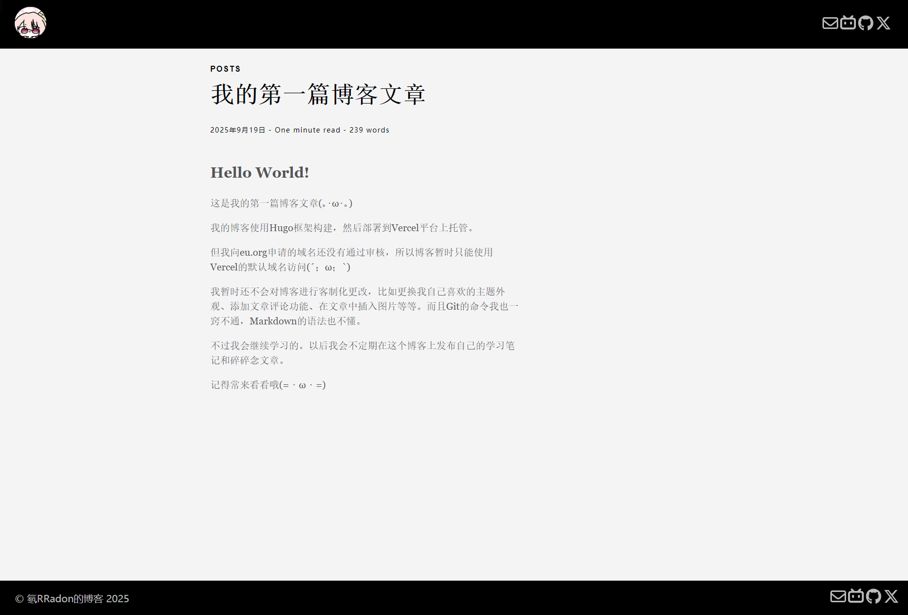
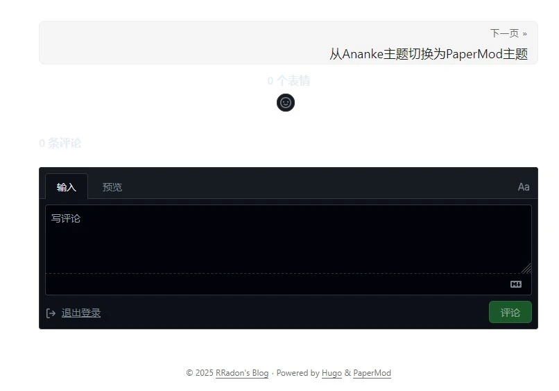
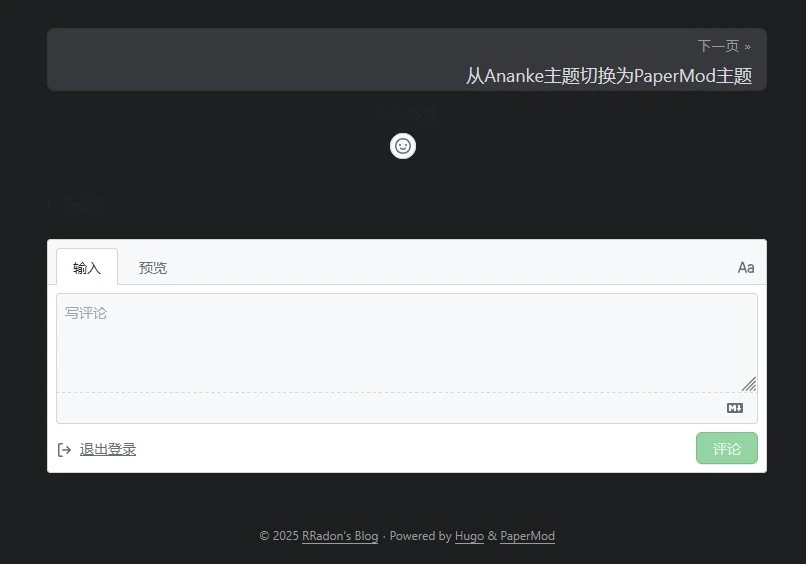

之前本来想用第三方图床插入图片，但作为一个小白，不太了解市面上有哪些免费同时又可靠的图床服务提供商。Cloudflare官方倒是有一个R2存储服务，问了一下ai得知免费计划好像已经足够我使用了。但订阅这个服务好像要绑卡，不知道国内普通的储蓄卡能不能行。而且没有自己的域名，使用默认的r2.dev，也不清楚会不会存在图片加载问题。看了下教程，在网站中接入这项服务，似乎还要自己写一些处理中间过程的代码，还是等到未来自己能力更强了再考虑吧……

现在暂时使用Hugo的[Page bundles](https://gohugo.io/content-management/page-bundles/)和[Page resources](https://gohugo.io/content-management/page-resources/)特性，然后用[Markdown的图片语法](https://www.runoob.com/markdown/md-image.html)在文章中插入图片。优点是上手比较简单，缺点是图片文件都保存在网站本地，随着越堆越多，不知道未来会不会出现什么性能问题。

顺便附上最初使用默认的Ananke主题时，博客的外观样貌（真的很毛胚房……）

现在也通过[二叉树树大佬的教程](https://2x.nz/posts/giscus-akismet)配置了[Giscus](https://giscus.app)评论系统，可以直接使用GitHub账号发表评论。优点是完全免费，因为使用的是GitHub仓库自带的Discussions功能。缺点是有一定使用门槛，因为需要发评论的人注册GitHub账户，而且GitHub在国内网络环境下的连通性属于是惨不忍睹……不过也相当于间接过滤了一部分垃圾机器人评论吧（话说真的会有人盯上我这样一个小网站嘛）。

不过Giscus现在有一个我暂时无法解决的问题，默认配置下的评论区主题外观，没办法跟随网站的白天/黑夜模式自动切换

但可以跟随用户手机/电脑的浅色/深色主题切换，所以我直接头痛医头，把网站主题的切换按钮去掉了……问了一下ai，Giscus倒是提供了一个[接口](https://github.com/giscus/giscus/blob/main/ADVANCED-USAGE.md#isetconfigmessage)，可以通过检测网站主题的状态来跟随改变外观，但我不会写HTML代码，也不敢随便将ai生成的代码用于生产环境，所以就暂时这样吧（我相信来访者自己手机/电脑选择的外观就是他们想要的，嗯……）

博客的主体功能现在好像都完善的差不多了。一些细节以后正式开始写文章时再考虑叭。